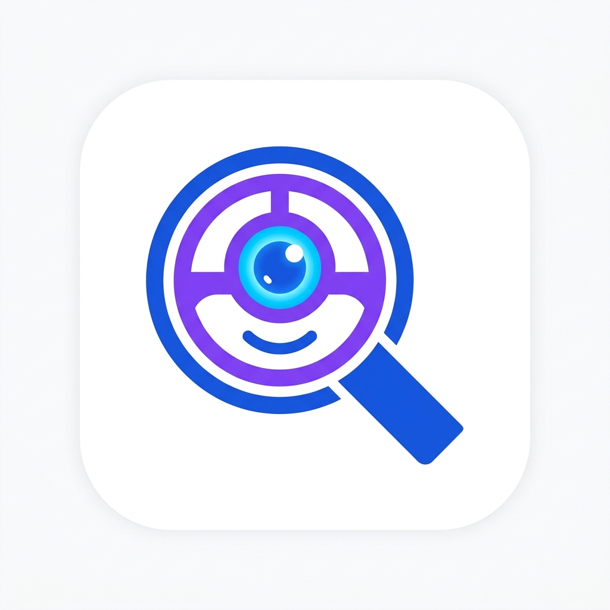

<div align="center">
  
</div>

<h1 align="center">HireLens AI - Resume Reviewer 🤖🚀</h1>

<p align="center">
  <a href="#"></a>
  <a href="#"></a>
  <a href="#"></a>
  <a href="#"></a>
  <a href="#"></a>
  <a href="#"></a>
</p>

<p align="center">
  <em>An intelligent system that evaluates your CV like a professional recruiter, providing ATS scores, skill mapping, and instant actionable feedback.</em>
</p>

---

## 🌟 Key Features

1. **AI-Powered Analysis (Llama-3 / Groq)**
   Extracts text locally from your PDF and sends it to a lightning-fast Large Language Model for evaluation.
2. **Overall & ATS Scores**
   Get a numerical representation of how good your CV is and how easily it can be parsed by automated tracking systems (ATS).
3. **Section-by-Section Critique**
   Assesses critical sections (Summary, Experience, Education, Skills, etc.) and provides instant improvement suggestions.
4. **Strengths & Weaknesses**
   Objectively highlights what you've done well and what you're missing based on your target role.
5. **Interactive AI Assistant (Lensy)**
   An animated character that accompanies you through every step, from *idle*, to *thinking*, to *celebrating* your results.
6. **Smooth & Responsive Animations**
   A premium-class interface featuring glassmorphism, `framer-motion` transitions, and full mobile responsiveness.

---

## 🛠️ Technologies Used

<div align="center">
  <a href="https://skillicons.dev">
    
  </a>
</div>
<br/>

- **Frontend Core**: [Next.js](https://nextjs.org/) (App Router), React, TypeScript
- **Styling**: [Tailwind CSS](https://tailwindcss.com/)
- **UI Components**: [shadcn/ui](https://ui.shadcn.com/) & Lucide Icons
- **Animation**: [Framer Motion](https://www.framer.com/motion/)
- **API & Data Fetching**: Axios
- **AI Processing**: `@langchain/groq` & Llama 3
- **Structured Data Validation**: Zod
- **PDF Extraction**: `pdf-parse`

---

## ⚙️ Requirements

Before starting, ensure you have the following:
1. **Node.js** (v18 or newer)
2. **NPM**, **Yarn**, or **pnpm**
3. A Groq API Key. Get yours at the [Groq Console](https://console.groq.com/).

---

## 🚀 Local Setup & Installation

1. **Clone the Repository**
   ```bash
   git clone https://github.com/username/ai-cv-reviewer.git
   cd ai-cv-reviewer
   ```

2. **Install Dependencies**
   ```bash
   npm install
   # or
   yarn install
   ```

3. **Configure Environment Variables**
   Create a `.env` (or `.env.local`) file in the root directory and add your API Key:
   ```env
   GROQ_API_KEY=your_groq_api_key_here
   ```

4. **Run the Development Server**
   ```bash
   npm run dev
   # or
   yarn dev
   ```

5. Open [http://localhost:3000](http://localhost:3000) in your browser to see the app.

---

## 📖 How to Use

1. **Landing Page**:
   You'll be greeted by an interactive homepage and **Lensy**, your AI Assistant, in the bottom right corner. Click **Try Now** or **Upload Your CV**.

2. **Upload & Analyze Page (`/analyze`)**:
   - Drag and drop or click the box to upload your **PDF CV** (Max 5MB).
   - Enter your **Target Role** (e.g., *Frontend Developer*, *Data Analyst*).
   - Select your **Seniority Level** (e.g., *Junior*, *Mid*, *Senior*).
   - (Optional) Paste a specific *Job Description* for tailored analysis.
   - Click **Start CV Analysis**. While processing (~5-10 seconds), Lensy will show a *thinking* indicator.

3. **Results Dashboard (`/results`)**:
   - Once completed, you will be redirected automatically to the Results Dashboard.
   - View your metrics via the visual *Overall Score* and *ATS Score* cards.
   - Review **Missing Skills**, **Areas for Improvement**, and **Core Strengths**.
   - Read the detailed **Section Feedback** to refine phrasing and keywords on your resume.
   - You can click **New CV Analysis** to try another document.

---

## 📄 Known Limitations

- Since file extraction uses a pure JavaScript library (`pdf-parse`), highly complex multi-column PDFs or scanned image-based PDFs may not be parsed perfectly. Use standard ATS-friendly PDF layouts.
- For deployment to serverless environments (e.g., Vercel), document extraction takes a few seconds. Ensure your server functions have an adequate timeout limit (Vercel Hobby plan max is 10 seconds; upgrading timeouts or using background jobs is recommended for production scale).

---

<div align="center">
  Built with ❤️ to help job seekers land their dream careers. 🌟
</div>
